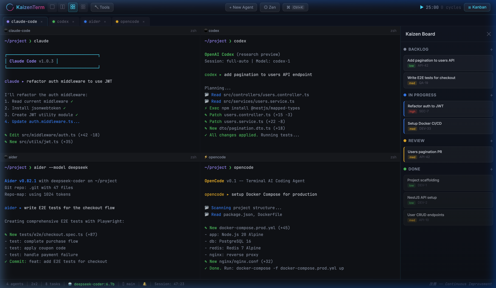

<p align="center">
  
</p>

<h1 align="center">🖥️ KaizenTerm</h1>

<p align="center">
  <strong>AI-Powered Terminal for Spec Driven Development</strong><br>
  <em>Orchestrate Claude Code, Codex CLI, Aider, OpenCode — all at once.</em>
</p>

<p align="center">
  <a href="https://opensource.org/licenses/MIT"></a>
  <a href="https://github.com/juancruzmunozalbelo/kaizen-term/stargazers"></a>
  
  
  
</p>

---

## ✨ What is KaizenTerm?

**KaizenTerm** is the first **Terminal Orchestration Cockpit** for the Vibe Coding era. Instead of running one terminal and one AI agent, KaizenTerm lets you orchestrate **multiple AI coding agents in parallel** — each in its own terminal pane, all connected through a unified Kanban board.

> _"Kaizen" (改善) — the Japanese philosophy of continuous improvement._

### The Problem

You're using Claude Code or Codex CLI in one terminal and doing everything sequentially. You want to fix the auth, add pagination, write tests, and setup Docker — but you can only do one thing at a time.

### The Solution

KaizenTerm gives you a **multi-pane terminal** where each pane runs a different AI coding agent. Add a task to the Kanban board, spawn an agent, and let them all work simultaneously:

```
📋 Kanban Task → ⚡ Spawn Agent → 🤖 AI Works → ✅ Auto-Done
```

## 🚀 Features

| Feature | Description |
|---|---|
| 🤖 **Multi-Agent Orchestration** | Run Claude Code, Codex CLI, Aider, OpenCode, Kilo Code side by side |
| 💬 **Natural Language → Commands** | Type `#` followed by plain English to get shell commands |
| 📋 **Integrated Kanban Board** | Create tasks, spawn agents for each, track progress |
| 🗂️ **Flexible Layouts** | 1, 2, 4, or 6 terminal panes with split layouts |
| 🔌 **MCP Integration** | Model Context Protocol server for enhanced AI context |
| ⏱️ **Focus Timer** | Built-in Pomodoro timer for focused sessions |
| 🎨 **Theme Engine** | Dark themes with dynamic switching |
| 📡 **@Mention Agents** | Chat referencing multiple agents: `@frontend @backend why CORS errors?` |
| 📦 **Starter Templates** | Pre-configured project starters (Fullstack, Python, Rust) |
| 🔍 **Codebase Indexing** | Automatic project context for smarter AI suggestions |

## 🛠️ Tech Stack

- **Runtime:** [Electron](https://www.electronjs.org/) + [Vite](https://vitejs.dev/)
- **Language:** [TypeScript](https://www.typescriptlang.org/)
- **AI Engine:** [Ollama](https://ollama.ai/) (DeepSeek Coder v2)
- **Terminal:** [xterm.js](https://xtermjs.org/)
- **MCP Server:** Custom Model Context Protocol server

## ⚡ Quick Start

### Prerequisites

- [Node.js](https://nodejs.org/) >= 18
- [Ollama](https://ollama.ai/) installed and running
- One or more AI coding agents installed (e.g., `claude`, `codex`, `aider`)
- macOS, Linux, or Windows

### Installation

```bash
# Clone
git clone https://github.com/juancruzmunozalbelo/kaizen-term.git
cd kaizen-term

# Install
npm install

# Run
npm run dev
```

### Build

```bash
npm run build
```

## 📁 Project Structure

```
kaizen-term/
├── electron/           # Electron main process
├── mcp-server/         # Model Context Protocol server
├── server/             # Backend server
├── src/
│   ├── modules/        # Feature modules
│   │   ├── terminal-manager.ts
│   │   ├── command-palette.ts
│   │   ├── kanban.ts
│   │   ├── focus-timer.ts
│   │   ├── themes.ts
│   │   ├── codebase-index.ts
│   │   └── plugin-api.ts
│   ├── styles/
│   └── main.ts
├── starters/           # Project templates
├── docs/               # Screenshots & GitHub Pages
└── package.json
```

## 🌐 Ecosystem

KaizenTerm is part of a suite of open-source AI development tools:

| Project | Description |
|---|---|
| [🖥️ KaizenTerm](https://github.com/juancruzmunozalbelo/kaizen-term) | Multi-agent terminal orchestrator (you are here) |
| [🐾 SwarmClaw](https://github.com/juancruzmunozalbelo/swarmclaw) | Autonomous multi-agent swarm control plane |
| [🏛️ SwarmDash](https://github.com/juancruzmunozalbelo/swarmdash) | Real-time AI agent dashboard |

## 🤝 Contributing

Contributions are welcome! See [CONTRIBUTING.md](CONTRIBUTING.md) for guidelines.

## 📄 License

MIT License — see [LICENSE](LICENSE).

## 👤 Author

**Juan Cruz Muñoz Albelo**
- GitHub: [@juancruzmunozalbelo](https://github.com/juancruzmunozalbelo)
- LinkedIn: [juan-cruz-albelo-](https://linkedin.com/in/juan-cruz-albelo-/)

---

<p align="center">
  Made with ❤️ and 改善 (Kaizen)
</p>
